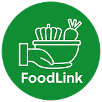

<p align="center">
  
</p>

<h1 align="center">Food Link</h1>

<p align="center">
  <strong>Selamatkan Makanan, Bantu Sesama</strong><br>
  A smart food donation platform bridging food donors and local food banks to minimize urban food waste.
</p>

<p align="center">
  <a href="https://laravel.com"></a>
  <a href="https://php.net"></a>
  <a href="https://tailwindcss.com"></a>
  <a href="https://leafletjs.com"></a>
  <a href="https://ai.google.dev"></a>
  <a href="LICENSE"></a>
</p>

---

## 📌 Project Overview

**Food Link** is a web-based community initiative designed to tackle food waste in metropolitan areas. Through an intuitive web portal, individuals and businesses can register surplus food, discover the nearest partner food banks on an interactive map, and leverage multimodal Artificial Intelligence to analyze food quality, calculate nutritional value, and forecast shelf life.

### Key Highlights
- **📍 Interactive Food Bank Map**: Real-time Leaflet.js map with device geolocation, distance computation, nearest food bank sorting, and direct routing.
- **🤖 Multimodal AI Food Analysis**: Analyzes uploaded food photos with Google Gemini models to identify items, compute macronutrients (Calories, Protein, Fat, Carbs), detect allergens, and suggest optimal storage methods.
- **📦 Donation Pipeline**: Complete tracking lifecycle (`pending` ➔ `approved` ➔ `picked_up` ➔ `completed` / `cancelled`) with instant photo verification.
- **🛡️ Admin Management Dashboard**: Comprehensive back-office dashboard to monitor donor activity, oversee food donation queues, filter records by status, and manage platform users.
- **👤 User Profile & History**: Donor records, real-time donation statuses, and customizable user profile credentials.

---

## 🚀 Installation & Usage

### Prerequisites
Before running the project, ensure you have the following installed:
- **PHP** >= 8.2 with `curl`, `mbstring`, `openssl`, `pdo_sqlite` / `pdo_mysql` extensions
- **Composer** (PHP Package Manager)
- **Node.js** (v18+) & **NPM**
- **Python** 3.12+ *(Required for AI Analysis microservice)*

---

### Step 1: Clone the Repository
```bash
git clone https://github.com/tian573/food-link.git
cd food-link
```

---

### Step 2: Automated Project Setup
Run the automated setup command to install dependencies, initialize environment files, generate encryption keys, link storage, and run database migrations:

```bash
composer run setup
```

> **Manual alternative (if preferred):**
> ```bash
> composer install
> cp .env.example .env
> php artisan key:generate
> php artisan storage:link
> php artisan migrate
> npm install
> npm run build
> ```

---

### Step 3: Run the Application
Start the Laravel backend and frontend asset compiler simultaneously:

```bash
composer run dev
```

The web application will be accessible at:
👉 **`http://localhost:8000`** *(or `http://127.0.0.1:8000`)*

---

### Step 4: Run the AI Server (Optional for AI Analysis)
To enable the **Analisis AI** feature during food uploads:

1. Configure your Google Gemini API Key in the AI microservice `.env` file:
   ```env
   GEMINI_API_KEY=your_gemini_api_key_here
   ```
2. In a separate terminal, navigate to the AI service directory and start the Flask server:
   ```powershell
   py -3.12 app.py
   ```
   *The AI service runs at `http://127.0.0.1:5000` and automatically connects to the Laravel app.*

---

## ℹ️ Additional Information

### System Architecture
The application is structured into two complementary components:
1. **Core Web App (Laravel 12 + Livewire + Blade)**: Handles database persistence, business rules, donor workflows, authentication, admin governance, and interactive mapping.
2. **AI Analysis Service (Python Flask + Google Gemini API)**: Receives uploaded food photographs, runs computer-vision nutrition assessments with automatic model fallback, and returns structured nutritional JSON.

### Storage & Assets
Uploaded food images and profile avatars are safely isolated inside `storage/app/public/` and served via Laravel's symbolic link `public/storage`.

---

## 👥 Project Team

This project was developed through collaborative engineering by:

- **Christian Lauren Samuel** – Full-Stack Web Development & Laravel Architecture
- **Kenji Lawrence** – Product Strategy & Concept Development
- **Kenneth Sebastian Razali** – UI/UX & Visual Design Lead
- **Williard Dextra Carlino Halim** – Machine Learning & AI Systems Engineer

---

## 📄 License

This project is open-sourced software licensed under the [MIT License](LICENSE).

